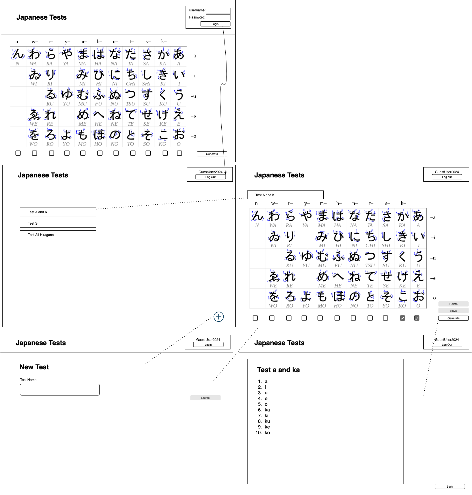

# [team name] Design Document

## Instructions

*Save a copy of this template for your team in the same folder that contains
this template.*

*Replace italicized text (including this text!) with details of the design you
are proposing for your team project. (Your replacement text shouldn't be in
italics)*

*You should take a look at the example design document in the same folder as
this template for more guidance on the types of information to capture, and the
level of detail to aim for.*

## Character Cooker: Japanese Character Writing Test Generator - Design

## 1. Problem Statement

The internet provides tons of resources to learn Japanese. Due to the limitations 
of computer inputs, many online character practice resources are limited to online 
flash cards, multiple choice Q&A, and typing the Romaji (the romanization of Japanese 
characters). What about romaji-to-character tests? Most of these tests are still 
limited to the options above or using the qwerty keyboard to spell out the japanese 
characters. Customers want to create their own writing. 

Character Cooker: is a Japanese romaji-to-character writing test generator. Customers
can access the website to create, edit and save their own test sets based on their individual
study plan. It is designed to interact with the Amazon Web Service, customers can save their
work to their account, and generate romaji-to-character tests. 

Learning symbolic characters takes a lot of memorization and writing is scientifically proven
to help people learn and memorize. Many romaji-to-characters test are limited to full sentences 
or few versions. Character Cooker will cook up as many version user request! (Or until our 
databases are full which we doubt will happen). 

## 2. Top Questions to Resolve in Review

1. Do I do tests based on each sets of characters or allow for the options of individual characters?
2. Do I add the feature of allowing users to add their own characters? Does this affect how
store my current design of japanese hiragana characters? 
3. Do I need make separate updates for the test name and character list or can they be the same?
4. The number of Hiragana characters is fixed. Do I need to store the character data in the backend
or in the database?

## 3. Use Cases

*This is where we work backwards from the customer and define what our customers
would like to do (and why). You may also include use cases for yourselves, or
for the organization providing the product to customers.*

As a Character Cooking customer...

U1. I want to create a new, empty test with a given name.

U2. I want to retrieve my test with a given ID.
    
U3. I want to update my test's name with a given ID.

U4. I want to update my test's character list (romaji list) with a given ID.

U5. I want to delete my test. 

U6. I want to generate my test in a provided order (default in order, shuffled);

## 4. Project Scope

### 4.1. In Scope

* Creating, retrieving, editing, or deleting a test
* Generate a test in a providing order

### 4.2. Out of Scope

* Allow users to add their own characters to the list
* Allow users to edit the layout of the generated tests
* The ability to search for other tests made by other users
* The ability to share tests between users

# 5. Proposed Architecture Overview

I will use API Gateway and Lambda to create 5 endpoints (`CreateTest`, `GetTest`, 
`UpdateTest`, )
that allows users to create, retrieve, edit, delete or generate their test.

Created accounts and tests will be stored in DynamoDB.

Character Cooker will also provide a web interface for users to interact with their
tests. The main page will let the user sign in. Once the user signs in, they can 
view a list of the tests they have created. Users can edit and generate tests from
their saved tests or create a new one from the main menu. 

# 6. API

## 6.1. Public Models

```
// TestModel

String id;
String name;
String username;
List<String> characters;
```

```
// AccountModel

String username;
String password;
```


## 6.2. *Create Test Endpoint*

*Describe the behavior of the first endpoint you will build into your service
API. This should include what data it requires, what data it returns, and how it
will handle any known failure cases. You should also include a sequence diagram
showing how a user interaction goes from user to website to service to database,
and back. This first endpoint can serve as a template for subsequent endpoints.
(If there is a significant difference on a subsequent endpoint, review that with
your team before building it!)*

* Accepts `POST` requests to `/tests`
* Accepts data to create a new test with a provided name, automatically enters username.
* Returns the new tests including the unique test ID assigned by the Japanese-Test-Service
* We will validate test names that do not contain invalid characters: `“ ‘ \`
  * If the test names contain any invalid characters, throw an `InvalidAttributeValueException`


*(repeat, but you can use shorthand here, indicating what is different, likely
primarily the data in/out and error conditions. If the sequence diagram is
nearly identical, you can say in a few words how it is the same/different from
the first endpoint)*

## 6.3 *Get Test Endpoint*
* Accepts `GET` request to `/Tests/:id`
* Accepts a test id 
  * If the test ID is not found, throw a `TestNotFoundException`
* Returns TestModel
  
## 6.4 *Update Test Endpoint*
* Accepts `PUT` request to `/Tests/:id`
* Accepts data to update the test's name or character name. 

## 6.5 *Delete Test Endpoint*
* Accepts `DELETE` request to `/Tests/:id`
* Accepts a test id and delete corresponding item and its attributes in the Tests
  * If the test ID is not found, throw a `TestNotFoundException`

## 6.6 *Generate Test Endpoint*
* Accept the `Get` request to `/Tests/:id/characters`
* Retrieves the list of characters with the given test ID
  * Returns the character list in default order
  * If the optional shuffle parameter is provided, the API will return the character in order or shuffled
    (based on the boolean value)
    * TRUE - returns the list of characters in random order
    * FALSE - returns the list of characters in order (default)
* If the test contains no characters, the character list will be empty

# 7. Tables

*Define the DynamoDB tables you will need for the data your service will use. It
may be helpful to first think of what objects your service will need, then
translate that to a table structure, like with the *`Playlist` POJO* versus the
`playlists` table in the Unit 3 project.*

### 7.1. `tests`

```
id // partition key, string
name // string
username // string
characterList // number
```

### 7.2. `accounts`

```
username // partition key, string
password // string
```

# 8. Pages

*Include mock-ups of the web pages you expect to build. These can be as
sophisticated as mockups/wireframes using drawing software, or as simple as
hand-drawn pictures that represent the key customer-facing components of the
pages. It should be clear what the interactions will be on the page, especially
where customers enter and submit data. You may want to accompany the mockups
with some description of behaviors of the page (e.g. “When customer submits the
submit-dog-photo button, the customer is sent to the doggie detail page”)*

